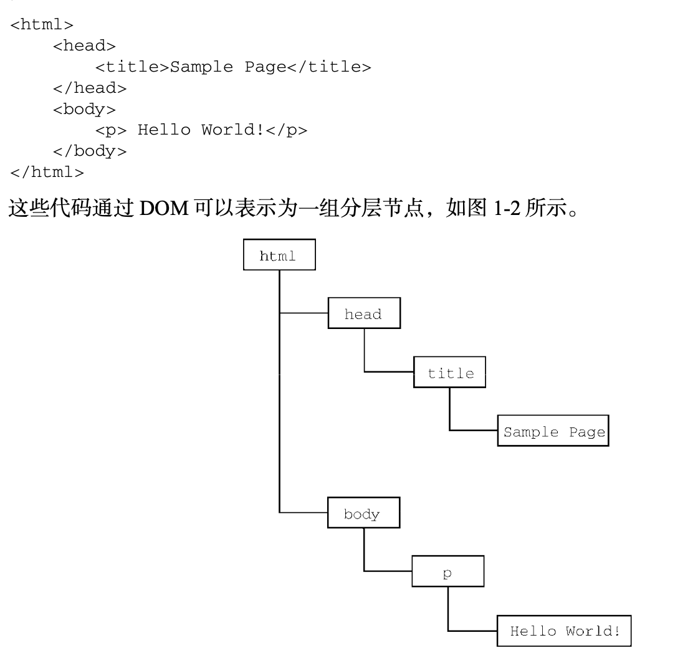

# javascript note

## Chapter 1 Intro

   js主要包含了三类:   
   + ECMAScript:核心.  
   + DOM：文档对象模型.    
   + BOM：浏览器对戏那个模型.   



## Chapter 3 变量相关

var和let的区别主要是
   1.变量提升
   2.在开发过程中会有重复命名的情况（多人协作情况下），var则不会报错，用let更好。
   3.let的作用域主要是块作用域，var主要是函数作用域。

##  Chapter 14 DOM 


### 14.1 node类型

#### 14.1.1 nodeType

+ Node.ELEMENT_NODE（1）

+ Node.ATTRIBUTE_NODE（2）

+ Node.TEXT_NODE（3）

+ Node.CDATA_SECTION_NODE（4） 

+ Node.ENTITY_REFERENCE_NODE（5）

+ Node.ENTITY_NODE（6）

+ Node.PROCESSING_INSTRUCTION_NODE（7）

+ Node.COMMENT_NODE（8）

+ Node.DOCUMENT_NODE（9）

+ Node.DOCUMENT_TYPE_NODE（10）

+ Node.DOCUMENT_FRAGMENT_NODE（11）

+ Node.NOTATION_NODE（12）

节点类型可通过与这些常量比较来确定，比如：  

if (someNode.nodeType == Node.ELEMENT_NODE){  

 	   alert("Node is an element.");  
 	}    
 	
这个例子比较了someNode.nodeType与Node.ELEMENT_NODE常量。如果两者相等，则意味着someNode是一个元素节点。  

#### 14.1.2 nodeName / nodeValue

每一个节点又都有两个属性
someNode.nodeName //元素的标签名字（比如p，span，body，head）  
someNode.nodeValue//元素的value

比如以下代码：  

```html
<body>
   <div class="container1">
      <div>
         123
      </div>
   </div>
<\body>
```

```javascript
<script>
var a = document.querySelector(".container1");
   console.log(a.nodeType);
   console.log(a.nodeName);
   **console.log(a.nodeValue); **
   console.dir(a)
</script> 
```

则会分别打印
1 ， DIV ， null ， 此节点的所有属性


#### 14.1.3 节点关系

   

#### 14.1.4 节点操作

   1.比较常用的是appendChild()  
   + 需要注意的是，添加节点之后返回的节点，就是添加的节点  
   + **并且添加之后这个节点在父节点的末尾**   

   `let returnedNode = someNode.appendChild(newNode);   
    alert(returnedNode == newNode); // true   
    alert(someNode.lastChild == newNode); // true `    

   2.insertBefore()  
   + 此操作两个参数，第一个是插入的节点，第二个是参照节点，若参照节点为null则此方法视为appendChild   
   + 添加节点之后返回的节点，就是添加的节点。   

   3.someNode.childNodes[x]  
   + 返回对应位置的node，x为其index。  

   4.replaceChild()  
   + 同样两个参数，插入的节点和需要取代的节点。  

   5.removeChild()  
   + 一个参数，需要注意的是返回的节点就是被移除的节点    

   6.cloneNode()
   + 传入false或者true,深浅拷贝

### 14.2 document类型

   它的属性：  
   nodeTyple 9
   nodeName 值为"#document"
   nodeValue 值为null
   parentNode 值为 null； 
   ownerDocument 值为 null；  

   1.获取html这个最外层的节点的方式：    
   + let html = document.documentElement;     
   + alert(html === document.childNodes[0]);  true    
   + alert(html === document.firstChild);   true   

   2.document.body     //直接指向body    
     document.title    //指向文档的title  
     document.URL  
     document.domain   //获取www.baidu.com/123/abc 中的www.baidu.com
     document.referrer  

   3.getElementById("")  //没找到返回null  
     getElementByTag("") // 比如传入img  div  
     getElementByName("")   

### 14.3 Element类型  

   nodeType 等于 1；    
   nodeName 值为元素的标签名；  
   nodeValue 值为 null；  
   parentNode 值为 Document 或 Element 对象；  

### 14.3 text类型

   nodeType 3;   
   nodeName  "text"    
   nodeValue  为节点中包含的文本。  
   parentNode 为element对象    
   不支持子节点


# JS 操作
    document.querySelector("")  获取整个节点


疑问：深浅拷贝的区别

markdown格式debug，代码 tab？四个空格？ 反引号

element 和 node 的区别
比如一个div 他就是一个node 
但是也是一个element？

